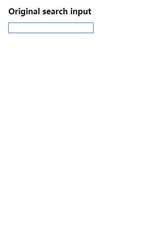

# react-composition-input
The input component optimized for languages like Chinese, Japanese etc. 

[](https://badge.fury.io/js/react-composition-input)

[Demo](https://leoeatle.github.io/react-composition-input/)


[中文文档](https://github.com/LeoEatle/react-composition-input/blob/master/README_CH.md)

# Usage

`npm install --save react-composition-input`

```javascript
import CInput from 'react-composition-input';

class App extends Component {
  render() {
    return (
      <CInput onInputChange={this.handleInputChange} />
    );
  }
}
```
# Example & Development

```bash
npm install
npm start
```


# Why
When we type non-latin languages, e.g. Chinese, we need IME to compose our input until a word selection has been made. However, when we are changing the input field's value during a composition, the `onChange` event emits before the composition is finished. Which is not what we expect. And frequently calling `onChange` function may affect page performance.

According to [DOM3 spec](https://w3c.github.io/uievents/#event-type-compositionstart), composition events can help us avoid emitting `onChange` event before the composition event is finished. We can use a variable to tag the status of a composition. By using `react-composition-input`, the `onInputChange` callback will only be called after `compositionend` event is emitted.

You can see the difference through the gif below.




You can read [this article by Evan You](http://blog.evanyou.me/2014/01/03/composition-event/) to know more about DOM composition event.

# Update
I find that some IME also behaves differently on composition event. If you use Apple native keyboard on iOS, the onInput event is emitted before the composition event. If you use Google keyboard instead, the composition event will never be emitted. The onInput event will only be emitted when the composition is over(which is a good thing but not a standard thing).

So I change the way to detect the sequence of event firing. To make it more compatible for most situations.

After `1.1.0`, you can set `value` as props to control the value in `CInput`. Thanks for the [PR from luyilin](https://github.com/LeoEatle/react-composition-input/pull/2).

# Q & A

### Why to detect Chrome and call `onInputChange` after `compositionend` event?
After Chrome v53, the `compositionend` event is emitted after `textInput` event. It causes that `compositionend` event emitted but `onInputChange` function is not be called. So we need to call `onInputChange` for another time.

You can see the [source code of chromium](https://chromium.googlesource.com/chromium/src/+/afce9d93e76f2ff81baaa088a4ea25f67d1a76b3%5E!/) for more details.

### Why to use [Parcel](https://parceljs.org/) as the bundler?
I use [Parcel](https://parceljs.org/) to develop because parcel is really simple and convenient to build a demo page for component. Don't worry if you use webpack or other bundlers because the production code is produced through [Babel](https://babeljs.io/).
